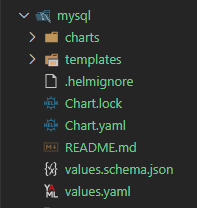

# intro-to-helm-charts-for-complete-beginners

## HISTORY

### How to Create a Helm Chart

#### Create a Chart Directory

##### helm create

1. `$> helm create helm-experiments`
1. `$> helm-experiments`

##### rm templates

1. `$> rm templates/hpa.yaml templates/ingress.yaml templates/serviceaccount.yaml`

##### values.yml

Edit the `values.yml` so it looks like this:

```yaml
replicaCount: 2

image:
  repository: traefik/whoami
  tag: "latest"
  pullPolicy: Always

service:
  name: whoami-svc
  type: ClusterIP
  port: 80
  targetPort: 80
```

#### Creating a Deployment

##### deployment.yml

Replace the contents `deployment` manifest with the configuration below:

```yaml
apiVersion: apps/v1
kind: Deployment
metadata:
  name: {{ .Release.Name }}-app
spec:
  replicas: {{ .Values.replicaCount }}
  selector:
    matchLabels:
      app: {{ .Release.Name }}-app
  template:
    metadata:
      labels:
        app: {{ .Release.Name }}-app
    spec:
      containers:
      - name: {{ .Chart.Name }}
        image: {{ .Values.image.repository }}:{{ .Values.image.tag }}
        ports:
        - containerPort: {{ .Values.service.port }}
```

#### Fix NOTES.txt

1. `$> helm install helm-experiments .`

> [!CAUTION]
> Seems that we deleted something in the `templates` folder that is still being referenced in the `NOTES.txt` file.

```shell
Error: INSTALLATION FAILED: template: helm-experiments/templates/NOTES.txt:2:14: executing "helm-experiments/templates/NOTES.txt" at <.Values.ingress.enabled>: nil pointer evaluating interface {}.enabled
```

Made a simplified `NOTES.txt` file

```yaml
# NOTES

## Top-Level

- replicaCount: {{ .Values.replicaCount }}

## image

- image: {{ .Values.image.repository }}@{{ .Values.image.tag }}
- pullPolicy: {{ .Values.image.pullPolicy }}

## service ({{ .Values.service.type }})

- name: {{ .Values.service.name }}
- ports: {{ .Values.service.port }}:{{ .Values.service.targetPort }}
```

#### First install

1. `$> helm install helm-experiments .`

```shell
NAME: helm-experiments
LAST DEPLOYED: Fri Jan 31 11:40:52 2025
NAMESPACE: default
STATUS: deployed
REVISION: 1
NOTES:
# NOTES

## Top-Level

- replicaCount: 2

## image

- image: traefik/whoami@latest
- pullPolicy: Always

## service ( ClusterIP )

- name: whoami-svc
- ports: 80:80
```

#### Check the pods

1. `$> kubectl get pods`

```shell
$ kubectl get pods
NAME                                    READY   STATUS    RESTARTS   AGE
helm-experiments-app-598bfd659f-99lm8   1/1     Running   0          4m37s
helm-experiments-app-598bfd659f-qgxdm   1/1     Running   0          4m37s
```

#### Check the service

1. `$> kubectl get svc`

```shell
$ kubectl get svc
NAME               TYPE        CLUSTER-IP    EXTERNAL-IP   PORT(S)   AGE
helm-experiments   ClusterIP   10.97.57.87   <none>        80/TCP    8m29s
kubernetes         ClusterIP   10.96.0.1     <none>        443/TCP   22m
```

### How to Host a Helm Chart

#### Push the Helm chart

1. `$> helm push helm-experiments-0.1.0.tgz oci://ttl.sh/jcystems-helm-experiments`

```shell
$ helm push helm-experiments-0.1.0.tgz oci://ttl.sh/jcystems-helm-experiments
Pushed: ttl.sh/jcystems-helm-experiments/helm-experiments:0.1.0
Digest: sha256:dbc9a1d823cc2ee7330b188af6d8700b70d4b1db2c90ce9490acd3f969d548a7
```

### Install from the registry

1. `$ helm install helm-exp oci://ttl.sh/jcystems-helm-experiments/helm-experiments`

```shell
$ helm install helm-exp oci://ttl.sh/jcystems-helm-experiments/helm-experiments
NAME: helm-exp
LAST DEPLOYED: Fri Jan 31 13:40:07 2025
NAMESPACE: default
STATUS: deployed
REVISION: 1
NOTES:
# NOTES

## Top-Level

- replicaCount: 2

## image

- image: traefik/whoami@latest
- pullPolicy: Always

## service (ClusterIP)

- name: whoami-svc
- ports: 80:80
```

1. `$> kubectl get pods`

```shell
$ kubectl get pods
NAME                           READY   STATUS    RESTARTS   AGE
helm-exp-app-84c58849b-jjgxx   1/1     Running   0          28s
helm-exp-app-84c58849b-wwklm   1/1     Running   0          28s
```

### Unistall

```shell
$>helm uninstall helm-exp
release "helm-exp" uninstalled
```

### Using Helm for Deployments and Rollbacks

#### Install Nginx

##### bitnami repo

1. `$> helm repo add bitnami https://charts.bitnami.com/bitnami`

```shell
$ helm repo add bitnami https://charts.bitnami.com/bitnami
"bitnami" already exists with the same configuration, skipping
```

Seems like I have run this command before...

##### helm install

1. `$> helm install nginx bitnami/nginx`

```shell
$ helm install nginx bitnami/nginx
Error: INSTALLATION FAILED: failed to download "bitnami/nginx"
```

##### Troubleshoot

I had to re-add the repo

1. `$> helm repo remove bitnami`
1. `$> helm repo add bitnami https://charts.bitnami.com/bitnami`
1. `$> helm install nginx bitnami/nginx`

```shell
$ helm install my-nginx bitnami/nginx
NAME: my-nginx
LAST DEPLOYED: Fri Jan 31 13:55:34 2025
NAMESPACE: default
STATUS: deployed
REVISION: 1
TEST SUITE: None
NOTES:
CHART NAME: nginx
CHART VERSION: 18.3.5
APP VERSION: 1.27.3

Did you know there are enterprise versions of the Bitnami catalog? For enhanced secure software supply chain features, unlimited pulls from Docker, LTS support, or application customization, see Bitnami Premium or Tanzu Application Catalog. See https://www.arrow.com/globalecs/na/vendors/bitnami for more information.

** Please be patient while the chart is being deployed **
NGINX can be accessed through the following DNS name from within your cluster:

    my-nginx.default.svc.cluster.local (port 80)

To access NGINX from outside the cluster, follow the steps below:

1. Get the NGINX URL by running these commands:

  NOTE: It may take a few minutes for the LoadBalancer IP to be available.
        Watch the status with: 'kubectl get svc --namespace default -w my-nginx'

    export SERVICE_PORT=$(kubectl get --namespace default -o jsonpath="{.spec.ports[0].port}" services my-nginx)
    export SERVICE_IP=$(kubectl get svc --namespace default my-nginx -o jsonpath='{.status.loadBalancer.ingress[0].ip}')
    echo "http://${SERVICE_IP}:${SERVICE_PORT}"

WARNING: There are "resources" sections in the chart not set. Using "resourcesPreset" is not recommended for production. For production installations, please set the following values according to your workload needs:
  - cloneStaticSiteFromGit.gitSync.resources
  - resources
+info https://kubernetes.io/docs/concepts/configuration/manage-resources-containers/
```

##### kubeclt get pods

1. `$> kubectl get pods`

```shell
$ kubectl get pods
NAME                        READY   STATUS    RESTARTS   AGE
my-nginx-545d54dc89-w89c2   0/1     Running   0          10s
```

##### kubectl get svc

1. `$> kubectl get svc`

```shell
$ kubectl get svc
NAME         TYPE           CLUSTER-IP      EXTERNAL-IP   PORT(S)                      AGE
kubernetes   ClusterIP      10.96.0.1       <none>        443/TCP                      149m
my-nginx     LoadBalancer   10.96.156.218   <pending>     80:31250/TCP,443:30165/TCP   54s
```

#### Scale Replicas

1. `$> helm upgrade --set replicaCount=3 my-nginx bitnami/nginx`

```shell
$ helm upgrade --set replicaCount=3 my-nginx bitnami/nginx
Release "my-nginx" has been upgraded. Happy Helming!
NAME: my-nginx
LAST DEPLOYED: Fri Jan 31 13:57:09 2025
NAMESPACE: default
STATUS: deployed
REVISION: 2
TEST SUITE: None
NOTES:
CHART NAME: nginx
CHART VERSION: 18.3.5
APP VERSION: 1.27.3

Did you know there are enterprise versions of the Bitnami catalog? For enhanced secure software supply chain features, unlimited pulls from Docker, LTS support, or application customization, see Bitnami Premium or Tanzu Application Catalog. See https://www.arrow.com/globalecs/na/vendors/bitnami for more information.

** Please be patient while the chart is being deployed **
NGINX can be accessed through the following DNS name from within your cluster:

    my-nginx.default.svc.cluster.local (port 80)

To access NGINX from outside the cluster, follow the steps below:

1. Get the NGINX URL by running these commands:

  NOTE: It may take a few minutes for the LoadBalancer IP to be available.
        Watch the status with: 'kubectl get svc --namespace default -w my-nginx'

    export SERVICE_PORT=$(kubectl get --namespace default -o jsonpath="{.spec.ports[0].port}" services my-nginx)
    export SERVICE_IP=$(kubectl get svc --namespace default my-nginx -o jsonpath='{.status.loadBalancer.ingress[0].ip}')
    echo "http://${SERVICE_IP}:${SERVICE_PORT}"

WARNING: There are "resources" sections in the chart not set. Using "resourcesPreset" is not recommended for production. For production installations, please set the following values according to your workload needs:
  - cloneStaticSiteFromGit.gitSync.resources
  - resources
+info https://kubernetes.io/docs/concepts/configuration/manage-resources-containers/
```

##### kubeclt get pods

1. `$> kubectl get pods`

```shell
$ kubectl get pods
NAME                        READY   STATUS    RESTARTS   AGE
my-nginx-545d54dc89-jdsc5   1/1     Running   0          25s
my-nginx-545d54dc89-w89c2   1/1     Running   0          2m
my-nginx-545d54dc89-wlx8k   1/1     Running   0          25s
```

##### helm history

1. `$> helm history my-nginx`

```shell
$ helm history my-nginx
REVISION        UPDATED                         STATUS          CHART           APP VERSION     DESCRIPTION
1               Fri Jan 31 13:55:34 2025        superseded      nginx-18.3.5    1.27.3          Install complete
2               Fri Jan 31 13:57:09 2025        deployed        nginx-18.3.5    1.27.3          Upgrade complete
```

#### Rollback Changes

##### helm rollback

1. `$> helm rollback my-nginx 1`

```shell
$ helm rollback my-nginx 1
Rollback was a success! Happy Helming!
```

##### kubectl get pods

1. `$> kubectl get pods`

```shell
$ kubectl get pods
NAME                        READY   STATUS    RESTARTS   AGE
my-nginx-545d54dc89-jdsc5   1/1     Running   0          6m6s
```

##### helm history

1. `$> helm history my-nginx`

```shell
$ helm history my-nginx
REVISION        UPDATED                         STATUS          CHART           APP VERSION     DESCRIPTION
1               Fri Jan 31 13:55:34 2025        superseded      nginx-18.3.5    1.27.3          Install complete
2               Fri Jan 31 13:57:09 2025        superseded      nginx-18.3.5    1.27.3          Upgrade complete
3               Fri Jan 31 14:02:58 2025        deployed        nginx-18.3.5    1.27.3          Rollback to 1
```

### How to Use Helm – Advanced Commands

#### Helm fetch

1. `$> helm fetch bitnami/mysql --untar`



#### Helm Dry Run

1. `$> helm install mysql --dry-run bitnami/mysql`

```bash
NAME: mysql
LAST DEPLOYED: Fri Jan 31 15:59:57 2025
NAMESPACE: default
STATUS: pending-install
REVISION: 1
TEST SUITE: None
HOOKS:
MANIFEST:
---
# Source: mysql/templates/networkpolicy.yaml
kind: NetworkPolicy
apiVersion: networking.k8s.io/v1
metadata:
  name: mysql
  namespace: "default"
  labels:
    app.kubernetes.io/instance: mysql
    app.kubernetes.io/managed-by: Helm
    app.kubernetes.io/name: mysql
    app.kubernetes.io/version: 8.4.4
    helm.sh/chart: mysql-12.2.2
    app.kubernetes.io/part-of: mysql
spec:
  podSelector:
    matchLabels:
      app.kubernetes.io/instance: mysql
      app.kubernetes.io/managed-by: Helm
      app.kubernetes.io/name: mysql
      app.kubernetes.io/version: 8.4.4
      helm.sh/chart: mysql-12.2.2
  policyTypes:
    - Ingress
    - Egress
  egress:
    - {}
  ingress:
    # Allow connection from other cluster pods
    - ports:
        - port: 3306
---
# Source: mysql/templates/primary/pdb.yaml
apiVersion: policy/v1
kind: PodDisruptionBudget
metadata:
  name: mysql
  namespace: "default"
  labels:
    app.kubernetes.io/instance: mysql
    app.kubernetes.io/managed-by: Helm
    app.kubernetes.io/name: mysql
    app.kubernetes.io/version: 8.4.4
    helm.sh/chart: mysql-12.2.2
    app.kubernetes.io/part-of: mysql
    app.kubernetes.io/component: primary
spec:
  maxUnavailable: 1
  selector:
    matchLabels:
      app.kubernetes.io/instance: mysql
      app.kubernetes.io/name: mysql
      app.kubernetes.io/part-of: mysql
      app.kubernetes.io/component: primary
---
# Source: mysql/templates/serviceaccount.yaml
apiVersion: v1
kind: ServiceAccount
metadata:
  name: mysql
  namespace: "default"
  labels:
    app.kubernetes.io/instance: mysql
    app.kubernetes.io/managed-by: Helm
    app.kubernetes.io/name: mysql
    app.kubernetes.io/version: 8.4.4
    helm.sh/chart: mysql-12.2.2
    app.kubernetes.io/part-of: mysql
automountServiceAccountToken: false
secrets:
  - name: mysql
---
# Source: mysql/templates/secrets.yaml
apiVersion: v1
kind: Secret
metadata:
  name: mysql
  namespace: "default"
  labels:
    app.kubernetes.io/instance: mysql
    app.kubernetes.io/managed-by: Helm
    app.kubernetes.io/name: mysql
    app.kubernetes.io/version: 8.4.4
    helm.sh/chart: mysql-12.2.2
    app.kubernetes.io/part-of: mysql
type: Opaque
data:
  mysql-root-password: "ekgwenMxVG5XMQ=="
  mysql-password: "V2VKekpnWWZIeQ=="
---
# Source: mysql/templates/primary/configmap.yaml
apiVersion: v1
kind: ConfigMap
metadata:
  name: mysql
  namespace: "default"
  labels:
    app.kubernetes.io/instance: mysql
    app.kubernetes.io/managed-by: Helm
    app.kubernetes.io/name: mysql
    app.kubernetes.io/version: 8.4.4
    helm.sh/chart: mysql-12.2.2
    app.kubernetes.io/part-of: mysql
    app.kubernetes.io/component: primary
data:
  my.cnf: |-
    [mysqld]
    authentication_policy='* ,,'
    skip-name-resolve
    explicit_defaults_for_timestamp
    basedir=/opt/bitnami/mysql
    plugin_dir=/opt/bitnami/mysql/lib/plugin
    port=3306
    mysqlx=0
    mysqlx_port=33060
    socket=/opt/bitnami/mysql/tmp/mysql.sock
    datadir=/bitnami/mysql/data
    tmpdir=/opt/bitnami/mysql/tmp
    max_allowed_packet=16M
    bind-address=*
    pid-file=/opt/bitnami/mysql/tmp/mysqld.pid
    log-error=/opt/bitnami/mysql/logs/mysqld.log
    character-set-server=UTF8
    slow_query_log=0
    long_query_time=10.0

    [client]
    port=3306
    socket=/opt/bitnami/mysql/tmp/mysql.sock
    default-character-set=UTF8
    plugin_dir=/opt/bitnami/mysql/lib/plugin

    [manager]
    port=3306
    socket=/opt/bitnami/mysql/tmp/mysql.sock
    pid-file=/opt/bitnami/mysql/tmp/mysqld.pid
---
# Source: mysql/templates/primary/svc-headless.yaml
apiVersion: v1
kind: Service
metadata:
  name: mysql-headless
  namespace: "default"
  labels:
    app.kubernetes.io/instance: mysql
    app.kubernetes.io/managed-by: Helm
    app.kubernetes.io/name: mysql
    app.kubernetes.io/version: 8.4.4
    helm.sh/chart: mysql-12.2.2
    app.kubernetes.io/part-of: mysql
    app.kubernetes.io/component: primary
spec:
  type: ClusterIP
  clusterIP: None
  publishNotReadyAddresses: true
  ports:
    - name: mysql
      port: 3306
      targetPort: mysql
  selector:
    app.kubernetes.io/instance: mysql
    app.kubernetes.io/name: mysql
    app.kubernetes.io/component: primary
---
# Source: mysql/templates/primary/svc.yaml
apiVersion: v1
kind: Service
metadata:
  name: mysql
  namespace: "default"
  labels:
    app.kubernetes.io/instance: mysql
    app.kubernetes.io/managed-by: Helm
    app.kubernetes.io/name: mysql
    app.kubernetes.io/version: 8.4.4
    helm.sh/chart: mysql-12.2.2
    app.kubernetes.io/part-of: mysql
    app.kubernetes.io/component: primary
spec:
  type: ClusterIP
  sessionAffinity: None
  ports:
    - name: mysql
      port: 3306
      protocol: TCP
      targetPort: mysql
      nodePort: null
  selector:
    app.kubernetes.io/instance: mysql
    app.kubernetes.io/name: mysql
    app.kubernetes.io/part-of: mysql
    app.kubernetes.io/component: primary
---
# Source: mysql/templates/primary/statefulset.yaml
apiVersion: apps/v1
kind: StatefulSet
metadata:
  name: mysql
  namespace: "default"
  labels:
    app.kubernetes.io/instance: mysql
    app.kubernetes.io/managed-by: Helm
    app.kubernetes.io/name: mysql
    app.kubernetes.io/version: 8.4.4
    helm.sh/chart: mysql-12.2.2
    app.kubernetes.io/part-of: mysql
    app.kubernetes.io/component: primary
spec:
  replicas: 1
  podManagementPolicy: ""
  selector:
    matchLabels:
      app.kubernetes.io/instance: mysql
      app.kubernetes.io/name: mysql
      app.kubernetes.io/part-of: mysql
      app.kubernetes.io/component: primary
  serviceName: mysql-headless
  updateStrategy:
    type: RollingUpdate
  template:
    metadata:
      annotations:
        checksum/configuration: 757e3d2d6ed1a044166f75109f07f33877a42e76178745a98f023a8cb31ed0b6
      labels:
        app.kubernetes.io/instance: mysql
        app.kubernetes.io/managed-by: Helm
        app.kubernetes.io/name: mysql
        app.kubernetes.io/version: 8.4.4
        helm.sh/chart: mysql-12.2.2
        app.kubernetes.io/part-of: mysql
        app.kubernetes.io/component: primary
    spec:
      serviceAccountName: mysql

      automountServiceAccountToken: false
      affinity:
        podAffinity:

        podAntiAffinity:
          preferredDuringSchedulingIgnoredDuringExecution:
            - podAffinityTerm:
                labelSelector:
                  matchLabels:
                    app.kubernetes.io/instance: mysql
                    app.kubernetes.io/name: mysql
                topologyKey: kubernetes.io/hostname
              weight: 1
        nodeAffinity:

      securityContext:
        fsGroup: 1001
        fsGroupChangePolicy: Always
        supplementalGroups: []
        sysctls: []
      initContainers:
        - name: preserve-logs-symlinks
          image: docker.io/bitnami/mysql:8.4.4-debian-12-r0
          imagePullPolicy: "IfNotPresent"
          securityContext:
            allowPrivilegeEscalation: false
            capabilities:
              drop:
              - ALL
            readOnlyRootFilesystem: true
            runAsGroup: 1001
            runAsNonRoot: true
            runAsUser: 1001
            seLinuxOptions: {}
            seccompProfile:
              type: RuntimeDefault
          resources:
            limits:
              cpu: 750m
              ephemeral-storage: 2Gi
              memory: 768Mi
            requests:
              cpu: 500m
              ephemeral-storage: 50Mi
              memory: 512Mi
          command:
            - /bin/bash
          args:
            - -ec
            - |
              #!/bin/bash

              . /opt/bitnami/scripts/libfs.sh
              # We copy the logs folder because it has symlinks to stdout and stderr
              if ! is_dir_empty /opt/bitnami/mysql/logs; then
                cp -r /opt/bitnami/mysql/logs /emptydir/app-logs-dir
              fi
          volumeMounts:
            - name: empty-dir
              mountPath: /emptydir
      containers:
        - name: mysql
          image: docker.io/bitnami/mysql:8.4.4-debian-12-r0
          imagePullPolicy: "IfNotPresent"
          securityContext:
            allowPrivilegeEscalation: false
            capabilities:
              drop:
              - ALL
            readOnlyRootFilesystem: true
            runAsGroup: 1001
            runAsNonRoot: true
            runAsUser: 1001
            seLinuxOptions: {}
            seccompProfile:
              type: RuntimeDefault
          env:
            - name: BITNAMI_DEBUG
              value: "false"
            - name: MYSQL_ROOT_PASSWORD
              valueFrom:
                secretKeyRef:
                  name: mysql
                  key: mysql-root-password
            - name: MYSQL_ENABLE_SSL
              value: "no"
            - name: MYSQL_PORT
              value: "3306"
            - name: MYSQL_DATABASE
              value: "my_database"
          envFrom:
          ports:
            - name: mysql
              containerPort: 3306
          livenessProbe:
            failureThreshold: 3
            initialDelaySeconds: 5
            periodSeconds: 10
            successThreshold: 1
            timeoutSeconds: 1
            exec:
              command:
                - /bin/bash
                - -ec
                - |
                  password_aux="${MYSQL_ROOT_PASSWORD:-}"
                  if [[ -f "${MYSQL_ROOT_PASSWORD_FILE:-}" ]]; then
                      password_aux=$(cat "$MYSQL_ROOT_PASSWORD_FILE")
                  fi
                  mysqladmin status -uroot -p"${password_aux}"
          readinessProbe:
            failureThreshold: 3
            initialDelaySeconds: 5
            periodSeconds: 10
            successThreshold: 1
            timeoutSeconds: 1
            exec:
              command:
                - /bin/bash
                - -ec
                - |
                  password_aux="${MYSQL_ROOT_PASSWORD:-}"
                  if [[ -f "${MYSQL_ROOT_PASSWORD_FILE:-}" ]]; then
                      password_aux=$(cat "$MYSQL_ROOT_PASSWORD_FILE")
                  fi
                  mysqladmin ping -uroot -p"${password_aux}" | grep "mysqld is alive"
          startupProbe:
            failureThreshold: 10
            initialDelaySeconds: 15
            periodSeconds: 10
            successThreshold: 1
            timeoutSeconds: 1
            exec:
              command:
                - /bin/bash
                - -ec
                - |
                  password_aux="${MYSQL_ROOT_PASSWORD:-}"
                  if [[ -f "${MYSQL_ROOT_PASSWORD_FILE:-}" ]]; then
                      password_aux=$(cat "$MYSQL_ROOT_PASSWORD_FILE")
                  fi
                  mysqladmin ping -uroot -p"${password_aux}" | grep "mysqld is alive"
          resources:
            limits:
              cpu: 750m
              ephemeral-storage: 2Gi
              memory: 768Mi
            requests:
              cpu: 500m
              ephemeral-storage: 50Mi
              memory: 512Mi
          volumeMounts:
            - name: data
              mountPath: /bitnami/mysql
            - name: empty-dir
              mountPath: /tmp
              subPath: tmp-dir
            - name: empty-dir
              mountPath: /opt/bitnami/mysql/conf
              subPath: app-conf-dir
            - name: empty-dir
              mountPath: /opt/bitnami/mysql/tmp
              subPath: app-tmp-dir
            - name: empty-dir
              mountPath: /opt/bitnami/mysql/logs
              subPath: app-logs-dir
            - name: config
              mountPath: /opt/bitnami/mysql/conf/my.cnf
              subPath: my.cnf
      volumes:
        - name: config
          configMap:
            name: mysql
        - name: empty-dir
          emptyDir: {}
  volumeClaimTemplates:
    - metadata:
        name: data
        labels:
          app.kubernetes.io/instance: mysql
          app.kubernetes.io/name: mysql
          app.kubernetes.io/component: primary
      spec:
        accessModes:
          - "ReadWriteOnce"
        resources:
          requests:
            storage: "8Gi"

NOTES:
CHART NAME: mysql
CHART VERSION: 12.2.2
APP VERSION: 8.4.4

Did you know there are enterprise versions of the Bitnami catalog? For enhanced secure software supply chain features, unlimited pulls from Docker, LTS support, or application customization, see Bitnami Premium or Tanzu Application Catalog. See https://www.arrow.com/globalecs/na/vendors/bitnami for more information.

** Please be patient while the chart is being deployed **

Tip:

  Watch the deployment status using the command: kubectl get pods -w --namespace default

Services:

  echo Primary: mysql.default.svc.cluster.local:3306

Execute the following to get the administrator credentials:

  echo Username: root
  MYSQL_ROOT_PASSWORD=$(kubectl get secret --namespace default mysql -o jsonpath="{.data.mysql-root-password}" | base64 -d)

To connect to your database:

  1. Run a pod that you can use as a client:

      kubectl run mysql-client --rm --tty -i --restart='Never' --image  docker.io/bitnami/mysql:8.4.4-debian-12-r0 --namespace default --env MYSQL_ROOT_PASSWORD=$MYSQL_ROOT_PASSWORD --command -- bash

  2. To connect to primary service (read/write):

      mysql -h mysql.default.svc.cluster.local -uroot -p"$MYSQL_ROOT_PASSWORD"


WARNING: There are "resources" sections in the chart not set. Using "resourcesPreset" is not recommended for production. For production installations, please set the following values according to your workload needs:
  - primary.resources
  - secondary.resources
+info https://kubernetes.io/docs/concepts/configuration/manage-resources-containers/
```
