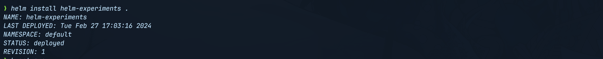
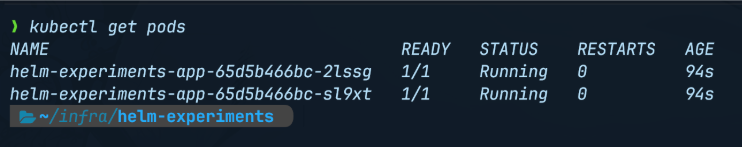

# intro-to-helm-charts-for-complete-beginners

## HISTORY

### Create a Chart Directory

#### helm create

This command will create a directory named helm-experiments with a basic chart structure and a set of files.

1. `helm create helm-experiments && cd helm-experiments`

The helm-experiments directory will contain several files and subdirectories:

- `Chart.yaml`: This file contains metadata about the current chart, such as the name, chart version, and description.
- `values.yaml`: This file defines the default configuration values for your chart.
- `templates/`: The templates directory contains the template files for your Kubernetes manifests (e.g., Deployments, Services, ConfigMaps).
- `charts/`: This directory stores chart dependencies if your chart relies on other charts.

To keep this demonstration simple, we would need to remove some of the generated files Helm created, in your terminal run the following commands:

#### rm templates

1. `$> rm templates/hpa.yaml templates/ingress.yaml templates/serviceaccount.yaml`

Helm generated manifests for a HorizontalPodAutoscaler , an ingress as well as a service account, which we would not be needing for this demonstration. If this fits your use case feel free to leave them.

At this point, your folder structure should look something like this:

```bash
.
├── Chart.yaml
├── charts
├── templates
│  ├── _helpers.tpl
│  ├── deployment.yaml
│  ├── NOTES.txt
│  ├── service.yaml
│  └── tests
│     └── test-connection.yaml
└── values.yaml
```

#### values.yml

Next, let’s change the default values helm generated, in your editor of choice open up values.yaml , it should look something like this:

```yaml
# Default values for helm-experiments.
# This is a YAML-formatted file.
# Declare variables to be passed into your templates.

replicaCount: 1

image:
  repository: nginx
  pullPolicy: IfNotPresent
  # Overrides the image tag whose default is the chart appVersion.
  tag: ""

imagePullSecrets: []
nameOverride: ""
fullnameOverride: ""

serviceAccount:
  # Specifies whether a service account should be created
  create: true
  # Annotations to add to the service account
  annotations: {}
  # The name of the service account to use.
  # If not set and create is true, a name is generated using the fullname template
  name: ""

podAnnotations: {}

podSecurityContext: {}
  # fsGroup: 2000

securityContext: {}
  # capabilities:
  #   drop:
  #   - ALL
  # readOnlyRootFilesystem: true
  # runAsNonRoot: true
  # runAsUser: 1000

service:
  type: ClusterIP
  port: 80

ingress:
  enabled: false
  className: ""
  annotations: {}
    # kubernetes.io/ingress.class: nginx
    # kubernetes.io/tls-acme: "true"
  hosts:
    - host: chart-example.local
      paths:
        - path: /
          pathType: ImplementationSpecific
  tls: []
  #  - secretName: chart-example-tls
  #    hosts:
  #      - chart-example.local

resources: {}
.....
autoscaling:
  enabled: false
  minReplicas: 1
  maxReplicas: 100
  targetCPUUtilizationPercentage: 80
  # targetMemoryUtilizationPercentage: 80

nodeSelector: {}

tolerations: []

affinity: {}
```

Edit the manifest so it looks like this:

```yaml
replicaCount: 2

image:
  repository: traefik/whoami
  tag: "latest"
  pullPolicy: Always

service:
  name: whoami-svc
  type: ClusterIP
  port: 80
  targetPort: 80
```

In the updated manifest we

- Set the replicaCount to two
- set the image repository tag and pull policy.
- On lines 8-12 we define the `service` `name`, `type` and `ports`: this is where helm’s templating comes into play as we can have different service types for each environment

As an example, for development we could have the service be of `type` `ClusterIP` and in Q/A or prod the service can be exposed as `LoadBalancer`.

### Templating in Helm

One of the key features that makes Helm so useful is its use of templating.

Helm uses the Go template language to generate Kubernetes manifest files dynamically during installation and upgrade operations.

Go templates provide advanced logic, iterations, conditionals, and more - making it easy to parameterize Kubernetes configurations. For example, templating allows you to inject certain values into your manifests only if specific conditions are met.

The template files reside in the templates/ directory of a Helm chart. Helm will combine these templates with the values.yaml file and render the final manifests to be deployed.
Some useful Go template directives used in Helm charts include:

- `{{ .Values.key }}`: Inject a value from values.yaml
- `{{ .Release }}`: Insert metadata about the release
- `{{- if .Values.key }}`: Evaluate conditional blocks
- `{{- range }}`: Iterate over collections

Since Go templates are compiled into the Helm binary, rendering is fast. This allows Helm to generate customized manifests quickly.

### Creating a Deployment

#### deployment.yml

With our desired values created we can shift our attention toward the deployment manifest, currently the helm generated manifest should look something like this:

```yaml
#templates/deployment.yaml
apiVersion: apps/v1
kind: Deployment
metadata:
  name: {{ include "helm-experiments.fullname" . }}
  labels:
    {{- include "helm-experiments.labels" . | nindent 4 }}
spec:
  {{- if not .Values.autoscaling.enabled }}
  replicas: {{ .Values.replicaCount }}
  {{- end }}
  selector:
    matchLabels:
      {{- include "helm-experiments.selectorLabels" . | nindent 6 }}
  template:
    metadata:
      {{- with .Values.podAnnotations }}
      annotations:
        {{- toYaml . | nindent 8 }}
      {{- end }}
      labels:
        {{- include "helm-experiments.selectorLabels" . | nindent 8 }}
    spec:
      {{- with .Values.imagePullSecrets }}
      imagePullSecrets:
        {{- toYaml . | nindent 8 }}
      {{- end }}
      serviceAccountName: {{ include "helm-experiments.serviceAccountName" . }}
      securityContext:
        {{- toYaml .Values.podSecurityContext | nindent 8 }}
      containers:
        - name: {{ .Chart.Name }}
          securityContext:
            {{- toYaml .Values.securityContext | nindent 12 }}
          image: "{{ .Values.image.repository }}:{{ .Values.image.tag | default .Chart.AppVersion }}"
          imagePullPolicy: {{ .Values.image.pullPolicy }}
          ports:
            - name: http
              containerPort: 80
              protocol: TCP
          livenessProbe:
            httpGet:
              path: /
              port: http
          readinessProbe:
            httpGet:
              path: /
              port: http
          resources:
            {{- toYaml .Values.resources | nindent 12 }}
      {{- with .Values.nodeSelector }}
      nodeSelector:
        {{- toYaml . | nindent 8 }}
      {{- end }}
      {{- with .Values.affinity }}
      affinity:
        {{- toYaml . | nindent 8 }}
      {{- end }}
      {{- with .Values.tolerations }}
      tolerations:
        {{- toYaml . | nindent 8 }}
      {{- end }}
```

Again this is a bit much for our use case so let’s simplify, and replace the contents deployment manifest with the configuration below:

```yaml
apiVersion: apps/v1
kind: Deployment
metadata:
  name: {{ .Release.Name }}-app
spec:
  replicas: {{ .Values.replicaCount }}
  selector:
    matchLabels:
      app: {{ .Release.Name }}-app
  template:
    metadata:
      labels:
        app: {{ .Release.Name }}-app
    spec:
      containers:
      - name: {{ .Chart.Name }}
        image: {{ .Values.image.repository }}:{{ .Values.image.tag }}
        ports:
        - containerPort: {{ .Values.service.port }}
```

In the updated manifest we are using Go template directives to inject values for the deployment `name`, container `image`, and `ports`:

The `{{ .Release.Name }}` template directive inserts the name of the Helm release. This ensures the deployment name is unique for each release of the chart.

For the container image we reference the repository and tag fields under the image key in values.yaml to set the container image dynamically.

#### service.yml

Now let’s take a look at the service manifest helm generated, it should look something like this:

```yaml
apiVersion: v1
kind: Service
metadata:
  name: {{ include "helm-experiments.fullname" . }}
  labels:
    {{- include "helm-experiments.labels" . | nindent 4 }}
spec:
  type: {{ .Values.service.type }}
  ports:
    - port: {{ .Values.service.port }}
      targetPort: http
      protocol: TCP
  selector:
    {{- include "helm-experiments.selectorLabels" . | nindent 4 }}
```

In the manifest above the `{{ include }}` directive references a named template, `.fullname` inserts the full name including release name.

Similar to above, this includes a named `labels` and `selector` template defined elsewhere and indents it by 4 spaces. In our case we do not have any labels defined.

The Service type is dynamically based on the `service.type` value defined in `values.yaml`, the service port is set using the number in the values.yaml file, `targetPort` is set to HTTP(port 80)

### First install

Finally, you can deploy the helm chart to your local cluster by running:

`$> helm install helm-experiments .`

Your output should be similar to:



#### My run

> [!CAUTION]
> Seems that we deleted something in the `templates` folder that is still being referenced in the `NOTES.txt` file.

```
Error: INSTALLATION FAILED: template: helm-experiments/templates/NOTES.txt:2:14: executing "helm-experiments/templates/NOTES.txt" at <.Values.ingress.enabled>: nil pointer evaluating interface {}.enabled
```

#### Fix NOTES.txt

Made a simplified NOTES.txt file

```yaml
# NOTES

## Top-Level

- replicaCount: {{ .Values.replicaCount }}

## image

- image: {{ .Values.image.repository }}@{{ .Values.image.tag }}
- pullPolicy: {{ .Values.image.pullPolicy }}

## service ({{ .Values.service.type }})

- name: {{ .Values.service.name }}
- ports: {{ .Values.service.port }}:{{ .Values.service.targetPort }}
```

```shell
NAME: helm-experiments
LAST DEPLOYED: Fri Jan 31 11:40:52 2025
NAMESPACE: default
STATUS: deployed
REVISION: 1
NOTES:
# NOTES

## Top-Level

- replicaCount: 2

## image

- image: traefik/whoami@latest
- pullPolicy: Always

## service ( ClusterIP )

- name: whoami-svc
- ports: 80:80
```

### Check the pods

Next, let’s verify resources were deployed correctly

`$> kubectl get pods`



We get two pods running just as we specified using the replicaCountvariable.

#### My run

```shell
$ kubectl get pods
NAME                                    READY   STATUS    RESTARTS   AGE
helm-experiments-app-598bfd659f-99lm8   1/1     Running   0          4m37s
helm-experiments-app-598bfd659f-qgxdm   1/1     Running   0          4m37s
```
