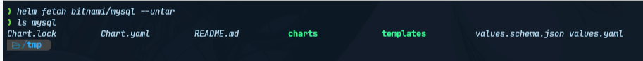
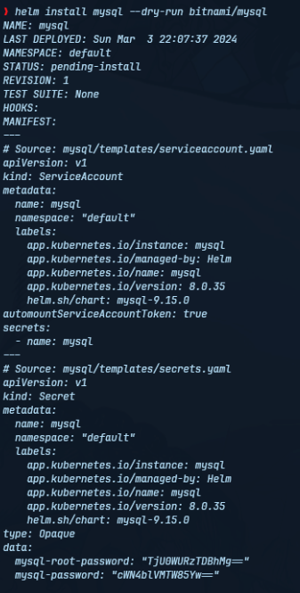

# Helm Charts Deep Dive for Advanced Users

## How to Use Helm – Advanced Commands

With an understanding of the internals of helm, lets turn our attention toward some advanced commands and use cases.

### Helm fetch

Often times before installing a chart, you’d like to inspect and possibly modify some values before installation, the helm fetch command allows us to do this, in this example we would be using the MySQL helm chart as an example:

1. `$> helm fetch bitnami/mysql --untar`

In a few minutes the MySQL helm chart should be download in the current working directory:

### Helm Dry Run

The `--dry-run` flag allows simulating a `helm install` or `helm upgrade` command. This is useful for validating any changes to a chart or its values before actually applying them.
For example, to simulate installing the MySQL chart:

1. `$> helm install mysql bitnami/mysql --dry-run`

This will print the Kubernetes manifests that would be applied, without deploying them on the cluster.

Dry run provides a valuable validation step in chart development and deployment workflows. It acts as a sandbox for experimenting with configuration changes and changing default values before actual deployment.
